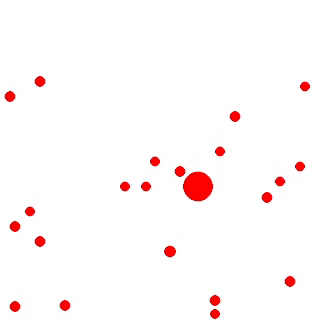

# Perfectly Elastic Collisions

A simulation of the conservation of momentum and perfectly elastic head-on collisions. Created using Python and Pygame (for rendering).

This project was created in collaboration with [Maxwell Hunt](https://github.com/Maxwell-Hunt).

## Inspiration
In Physics class, we both learned about **law of conservation of momentum** and the formulas for **perfectly elastic head-on collisions**. This inspired us to create a simulation to learn about the basics needed to develop a physics engine.

## Requirements
* Download Python version 3.9.7 [here](https://www.python.org/downloads/release/python-397/).
* Install [Pygame](https://pypi.org/project/pygame/). This project was tested on Pygame 2.1.2.

To run the project, download it as a ZIP, extract to a folder, and run `main.py`.

## How it works
When a collision between two balls occurs, we calculate the surface normal at the point of contact (hit normal). We can then treat the collision as a one-dimensional collision problem along this normal.

### Solving for ${v_f}_1$ using equation derived from the law of conservation of momentum
$$
{v_f}_1=\frac{m_1-m_2}{m_1+m_2}({v_i}_1) + \frac{2m_2}{m_1+m_2}({v_i}_2)
$$

### Solving for ${v_f}_2$ using equation derived from the law of conservation of momentum
$$
{v_f}_2=\frac{2m_1}{m_1+m_2}({v_i}_1) + \frac{m_2-m_1}{m_1+m_2}({v_i}_2)
$$

In order to use these equations, we must find the component of the velocities of the two balls in the direction of the hit normal. To do this we take the dot product of the velocity of each ball and the calculated unit hit normal.

After calculating the result of the one dimensional elastic collision, we only want to affect the component of the velocity of each ball along the hit normal. We do this by first subtracting the original component along the hit normal and then adding the new resultant component to the ball's velocity.

For the sake of practicality, in collisions with the boundaries/window edges, the boundaries are treated as objects with infinite mass.

For further reading and inspiration on how collision detection and resolution can be achieved, I strongly recommend checking out [Designing a physics engine](https://blog.winter.dev/2020/designing-a-physics-engine/) by Iain Winter.

## License
This project is licensed under the Unlicense which can be read [here](LICENSE).